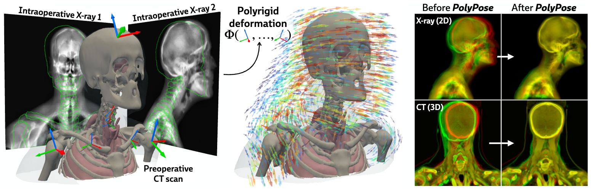
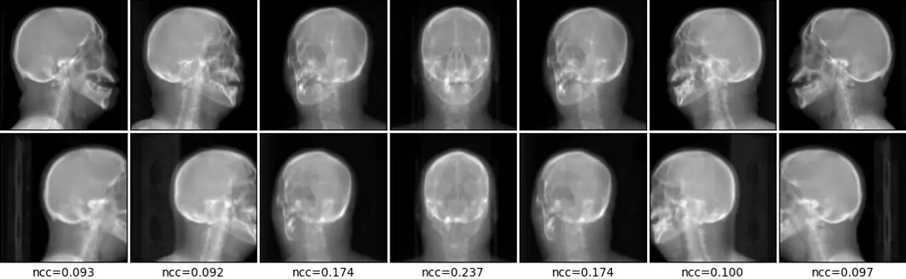

# PolyPose

[](https://arxiv.org/abs/2505.19256)
[](LICENSE)
<a href="https://colab.research.google.com/drive/1hzYpjoVjGUF-nvhF_p0fMKCJPbrmUtUl?usp=sharing"></a>
[](https://github.com/astral-sh/uv)



*Localizing deformable anatomy in 3D from sparse 2D X-ray images using polyrigid transforms.*

## Highlights

PolyPose is a fully deformable 2D/3D registration framework.

- 🔭 PolyPose is effective in both **sparse-view** and **limited-angle** registration.
- 🦾 PolyPose accurately solves this highly ill-constrained problem with polyrigid transforms.
- 🫀 PolyPose has been tested on multiple anatomical structures from different clinical specialties.



## Tutorial

After [setting up the environment](#setup), check out the tutorial notebook in [`notebooks/pelvis.ipynb`](notebooks/pelvis.ipynb) for a demonstration of PolyPose.

*Note*: 

- This tutorial requires ≥24 GB of VRAM.
- We are working on a tutorial with a smaller memory footprint that can be run on Google Colab (coming soon!).

## Setup

PolyPose depends on the following packages:
```
torch
diffdrr    # Differentiable X-ray rendering
xvr        # Rigid 2D/3D registration
monai      # Evaluation metrics
cupy       # GPU-accelerated distance field computations
jaxtyping  # Extensive type hints!
```

Download the package:
```
git clone https://github.com/eigenvivek/polypose
cd polypose
```

You can install the required packages using `virtualenv`:
```
python -m venv .venv
source .venv/bin/activate
pip install -r requirements.txt
```

Or you can set up the packages using [`uv`](https://docs.astral.sh/uv/):
```
# Install uv, if necessary
curl -LsSf https://astral.sh/uv/install.sh | sh

# Set up the virtual environment
uv venv
uv sync --all-groups
```
